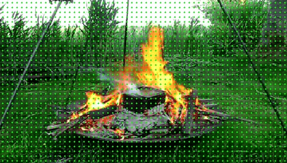
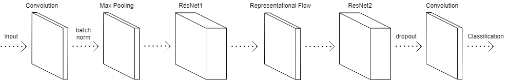

# Real-time Fire Detection and Localization within Video Imagery using Contemporary Advances in Deep Neural Networks
## Abstract
> The ineffectiveness of traditional smoke and heat based fire detection systems in well-ventilated, outdoor areas combined with the increasing omnipresence of security cameras highlights the possibility of a widespread computer-vision-based fire detection system. Furthermore, research into the field could introduce the use of autonomous fire fighting systems capable of saving time, money and lives. The aim of this project is to explore the use of optical flow algorithms, specifically representational flow, with deep residual convolutional neural networks as a visual fire detection system. We will undertake an evaluation of the current state of the art in the field and produce a model able to detect the presence of fire within a video accurately. A fire video dataset is compiled and pre-processed using datasets produced by prominent papers in the field to train a deep network capable of binary fire classification containing at least one representational flow layer. To support this, we introduce several sampling strategies and examine the effect of varying network depth on performance. The most accurate computer-vision-based fire detection system produced correctly classified 78.06% of videos on an independent evaluation dataset. Our results does not improve upon the state of the art, which achieves an accuracy of 97.92%. However, it does support the continued research into temporal fire detection systems with robust and rigorous investigation into the research question.

## Solution
This is the implementation of [Representational Flow for Action Recognition](https://github.com/piergiaj/representation-flow-cvpr19) adapted for fire detection.
<figure width="100%">
    
</figure>

The model uses representational flow (a fast approximation to optical flow) to track the movement of the objects within a video. An example of movement information extracted from a video is shown above. This information is then fed into a deep CNN to identify the presence of fire. The full architecture is shown below.
<figure width="100%">
    
</figure>

For further details, the full report can be found [here](./resources/report.pdf).